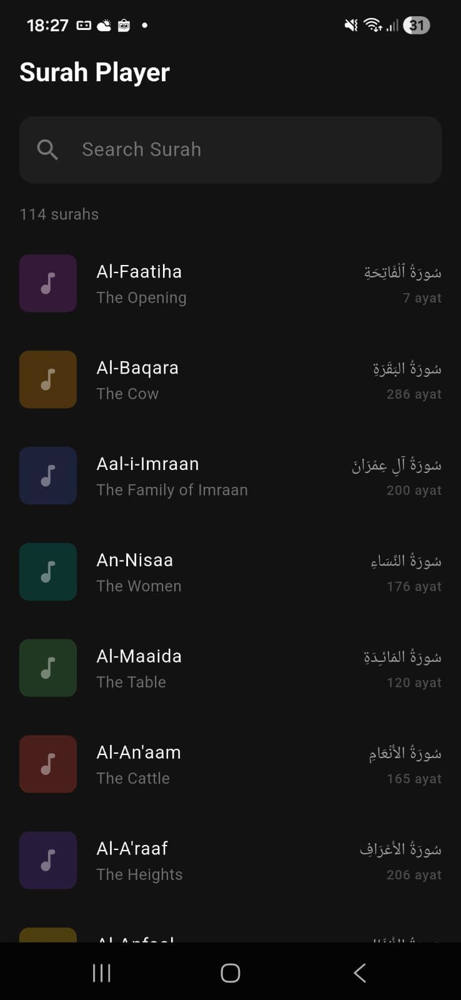
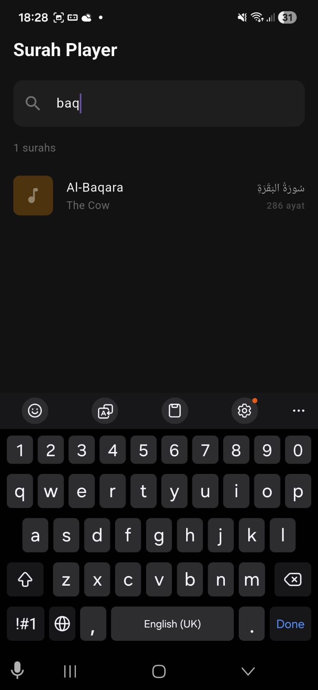
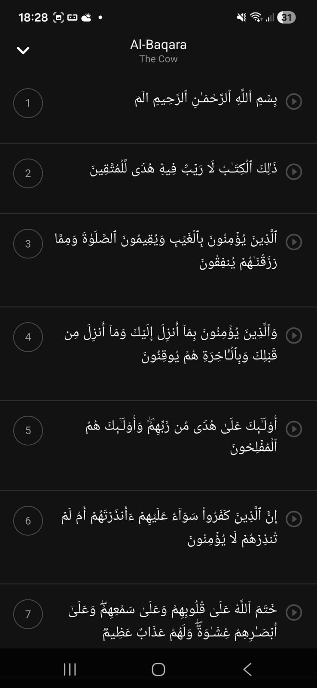
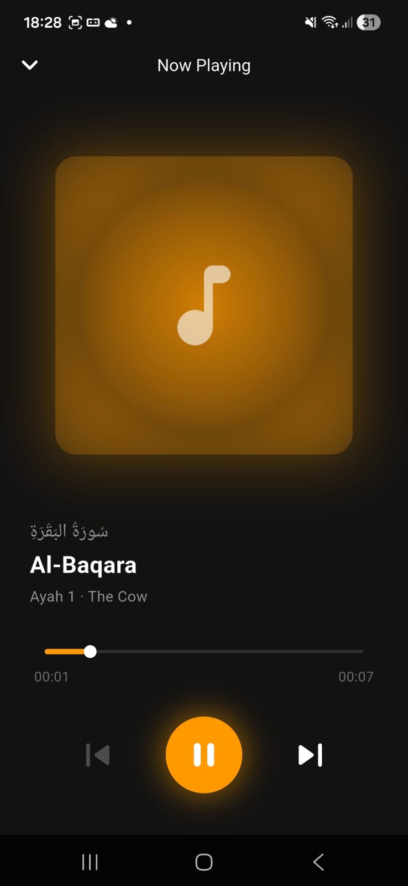

# Tech Test — Quran Player App

Aplikasi mobile untuk mendengarkan audio Al-Quran per ayah. Pengguna dapat mencari surah, memilih ayah, dan memutarnya dengan kontrol play/pause serta progress bar.

---

## Fitur

- Daftar 114 surah dari API AlQuran Cloud
- Pencarian surah berdasarkan nama
- Pemilihan ayah per surah
- Pemutar audio per ayah dengan progress bar dan seeking
- Indikasi loading saat audio sedang disiapkan

---

## Screenshots

| Home | Search | Ayah List | Player |
|---|---|---|---|
|  |  |  |  |

---

## Struktur Folder

```
lib/
├── const/      # Variable hardcode aplikasi
├── bloc/       # State management (BLoC/Cubit)
├── logic/      # Proses dan bisnis logika aplikasi
├── model/      # Struktur model data
├── screen/     # Halaman UI aplikasi
├── services/   # Template layanan yang digunakan oleh logic
└── widget/     # Widget yang dipakai berulang kali
```

## Tech Stack

| | |
|---|---|
| Framework | Flutter |
| State Management | flutter_bloc (Cubit) |
| HTTP | http + IOClient |
| Audio | audioplayers |
| Navigasi | page_transition |
| API | [AlQuran Cloud](https://alquran.cloud/api) |
